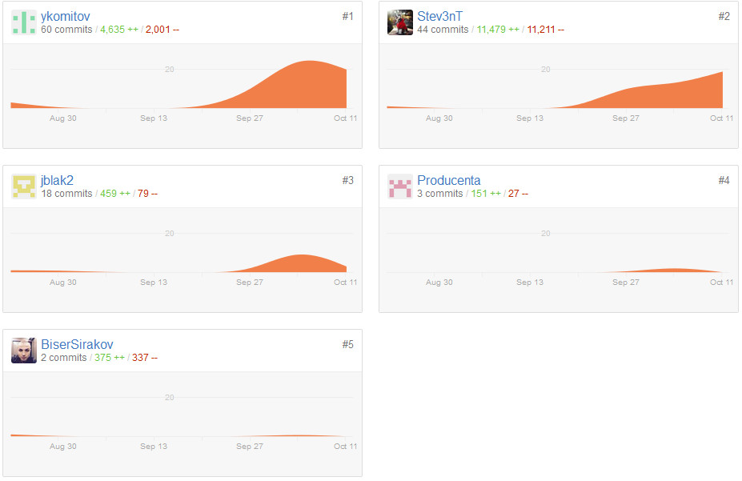

# Minesweeper 5 - Refactoring Documentation

### Project Contributors:
*   ykomitov (Yavor Komitov) 
*   Stev3nT (Steven Tsvetkov)
*   jblak2 (Ivo Dimitrov)

Teammates with contribution close to the Absolute Zero: BiserSirakov (Biser Sirakov) & Producenta (Iliyan Adkov)

Teammates we've never seen: evilshadow (Krasimir Georgiev)

**Github project contributions as of 12.10.2015 15:30**

## Refactoring steps

### 01. Initial refactoring of the given source code

Initially the given source code was refactored to improve naming and then the given classes were split in smaller parts to improve our understanding of the game logic:

1. Class Board.cs was renamed into PlayingField. The jagged array, holding the playing field was changed to a simple matrix
2. The Field class was renamed to Cell.cs, and is holding information about each cell in the playing field 
 - Cell status - opened, closed, flagged,
 - If the cell is holdign a mine
 - The value of the cell (how many cells with mines are neighboring this cell)
3. Removed Player.cs - its functionality has been transfered to the Scoreboard.cs class, which takes care of reading/writing players and highscores to a .txt file
4. Class Game.cs has been redesigned to be as SOLID as possible - the new class is responsible for taking care of the game play only. All other methods were extracted into new classes

### 02. Redesign of the project structure

The project was renamed to "Minesweeper". New project structure was implemented. The project was divided into 3 parts:

*	CLI - The Command Line Interface makes connection with the game core logic, handles user input and prints the game to the console
*   Core - Holds the core logic of the game
*   Utils - Holds utilities which are common for both CLI and game core logic

### 03. New functionalities implemented to improve game play
1. The first opened cell is never containing a mine - to achieve this mines are initialized after the user opens one cell
2. Flagging/unflagging a cell - when a cell is flagged it could not be opened by the user during game play
3. Undo functionality - user can roll back all his/her actions until the beginning of the game
4. Auto-open functionality - when a user opens a cell with value = 0 (i.e all surrounding cell do not contain any mines) the surrounding cells are recursively opened
5. Flags & mines counter displayed during each game - showing the number of mines on the board and the number of flags, which have been placed
6. Top players & scores are read/written from a .txt file
7. Difficulty levels added - currently the player can choose from 3 pre-set difficulty levels

### 04. Design patterns introduced
1. Memento for undo functionality - in Memento.cs class in Minesweeper.Core namespace
2. Simple factory - in MenuPrinter.cs class in Minesweeper.CLI namespace
3. Prototype - Cell.cs class implements the IClonable interface to enable fast cloning without using the new keyword, while the playinig field is being populated with cells
4. Singleton - Game.cs class. Game is initialized only once through the static Instance() method
5. State - Game.cs class - the StartNewGame() method automatically invokes different methods based on the state of the game. The game state is determined in each turn, the player makes during his/her gameplay by the OpenCell method in the PlayingField class

### 05. XML Documentation in the source code & generation of a .chm file

Everything in the game's source code was documented using internal XML comments except the unit tests, which are pretty much self documenting. Help file was generated using Sandcastle and is currently located into the root directory of the new game project.

### 06. Unit tests created, targeting high code coverage

Last but not least, some unit tests were created to test the public methods in the code. Unfortunately no mocking was used, due to time constraints.